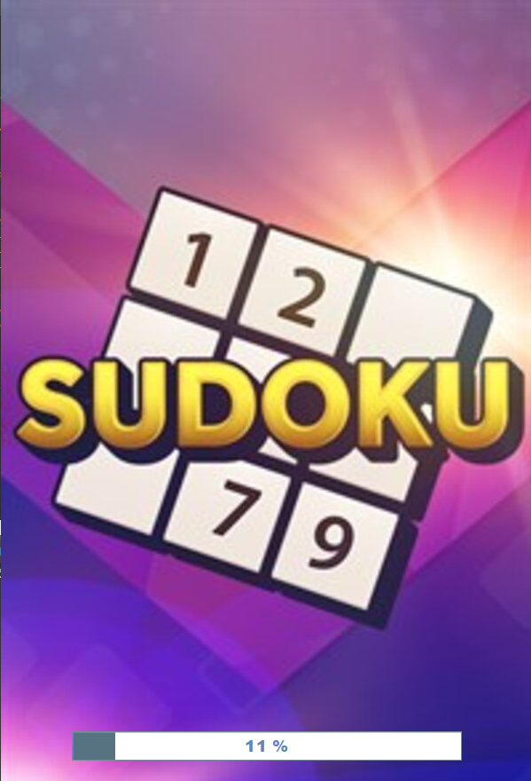
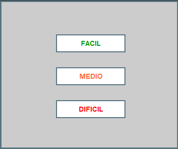
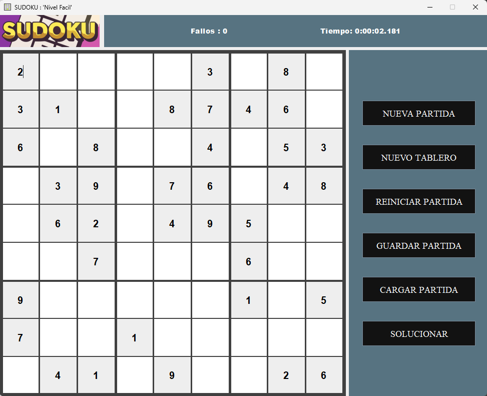
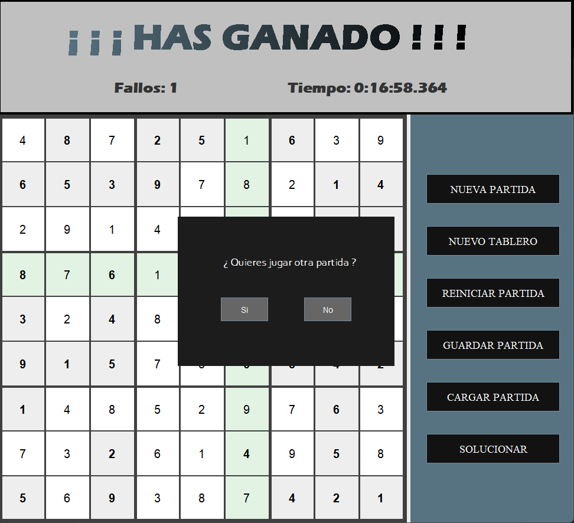

# 🧩Sudoku
Sudoku es un juego completo desarrollado en Java con una interfaz gráfica (Swing), enfocado en la experiencia del usuario, la personalización del juego y el aprendizaje de patrones de diseño.

## ✨ Funcionalidades

- Pantalla de carga animada antes de iniciar el juego
- Selección de nivel de dificultad: Fácil, Medio o Difícil
- Generación automática de tableros válidos
- Validación en tiempo real de las jugadas del usuario
- Resaltado de errores y celdas seleccionadas
- Detección automática de victoria y reproducción de sonido
- Temporizador y contador de fallos
- Guardado y carga de partidas por nivel de dificultad
- Solución automática del tablero

## 🧪 Tecnologías utilizadas

- Java SE 8+
- Java Swing (GUI)
- Patrón de diseño Singleton modificado
- Archivos locales para persistencia de partidas
- Gestión de sonido con `javax.sound.sampled`

## ▶️ Ejecución del proyecto

### Requisitos

- JDK 8 o superior instalado
- NetBeans (recomendado) o cualquier IDE Java compatible

### Compilación y ejecución

1. Clona el repositorio:
   ```bash
   git clone https://github.com/DavidJaviLabs/Sudoku
   ```

2. Ejecuta la clase principal:
    ```bash
    cd src
    javac Sudoku/ClaseMainSudoku.java
    java Sudoku.ClaseMainSudoku
    ```

> Asegúrate de ejecutar desde el nivel donde esté visible el paquete `Sudoku`.

### Pantalla de carga


### Interfaz de dificultad


### Interfaz principal sudoku


### Interfaz victoria


## 👥 Autores

Proyecto realizado por Javier Sáez García y David Escribano Arias.
